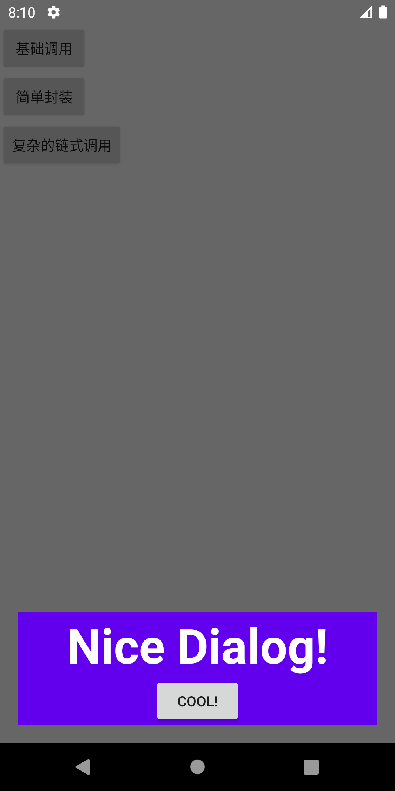
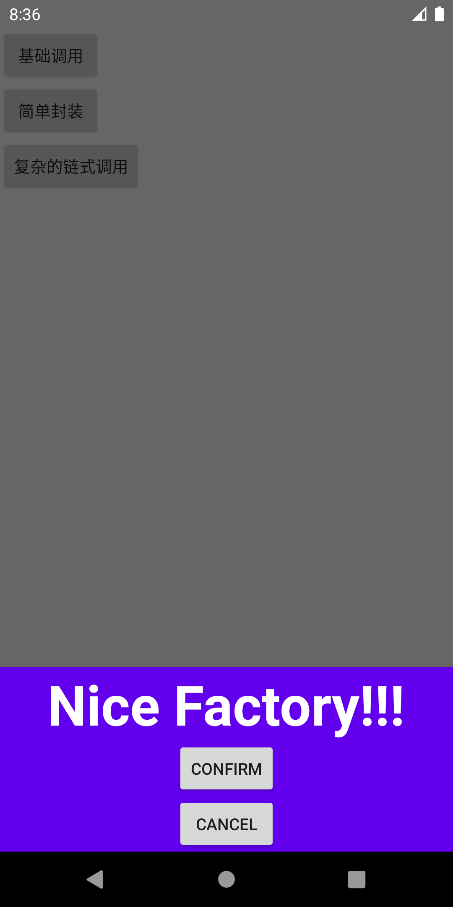

# NiceDialog
A Very Nice Dialog For Android Developer.

## 导入

在项目`build.gradle`文件中添加：

```gradle
repositories {
    maven { url 'https://jitpack.io' }
}
//...
implementation 'com.github.michaellee123:NiceDialog:1.3.1'
```

## 简单使用

首先需要你的项目支持ViewBinding，在gradle文件中添加如下代码

 ```gradle
android {
    //...
    viewBinding {
        enabled = true
    }
}
 ```

⚠️注意，在1.2.0及以前版本仅支持DataBinding，1.2.1之后推荐使用ViewBinding
 
 ## 创建一个布局
 
 `dialog_nice.xml`
 
 ```xml
<LinearLayout xmlns:android="http://schemas.android.com/apk/res/android"
    android:layout_width="match_parent"
    android:layout_height="match_parent"
    android:background="@color/colorPrimary"
    android:gravity="center"
    android:orientation="vertical">

    <TextView
        android:id="@+id/tvMessage"
        android:layout_width="wrap_content"
        android:layout_height="wrap_content"
        android:textColor="#ffffff"
        android:textSize="48sp"
        android:textStyle="bold" />

    <Button
        android:id="@+id/btnConfirm"
        android:layout_width="wrap_content"
        android:layout_height="wrap_content" />

</LinearLayout>
 ```
 
 现在会自动创建一个类 `DialogNiceBinding`。
 
 如果是DataBinding需要用`<layout></layout>`包裹整个布局。
 
 ## 使用NiceDialog显示一个弹窗
 
```kotlin
NiceDialog(DialogNiceBinding::class.java)
    .config {
        //可以在这里配置一些属性，按需配置即可，不用写完。
        width = WindowManager.LayoutParams.MATCH_PARENT //default is MATCH_PARENT
        height = WindowManager.LayoutParams.WRAP_CONTENT //default is MATCH_PARENT
        gravity = Gravity.BOTTOM //this is default value
        backgroundColor = 0x00000000 //this is default value
        paddingTop = 0 //this is default value
        paddingBottom = 48 //default is 0
        paddingLeft = 48 //default is 0
        paddingRight = 48 //default is 0
        cancelable = true //this is default value
        animatorStyleRes = R.style.NiceDialog_Animation_SlideBottom //默认是0，0就没有动画
    }.bind {
        //在这里绑数据或者是事件
        binding.tvMessage.text = "Nice Dialog!"
        binding.btnConfirm.text = "Cool!"
        binding.btnConfirm.setOnClickListener { 
            //关闭弹窗
            dismiss()
        }
    }.show(supportFragmentManager, "tag")//显示新的dialog会关闭相同tag的旧的dialog，tag需要全局唯一
```

简单的两步操作之后你就能看到一个这样的弹窗了。



你也可以使用 `tag` 来关闭弹窗。

```kotlin
NiceDialog.dismiss("tag")
```

## 代码封装

在项目中，一个弹窗通常会使用很多次，所以我也提供了`NiceDialogFactory`。举个例子。

`dialog_circle.xml`

```xml
<RelativeLayout xmlns:android="http://schemas.android.com/apk/res/android"
    android:layout_width="match_parent"
    android:layout_height="match_parent">

    <ProgressBar
        android:id="@+id/progressBar"
        style="?android:attr/progressBarStyle"
        android:layout_width="wrap_content"
        android:layout_height="wrap_content"
        android:layout_centerInParent="true" />
</RelativeLayout>
```

然后再创建一个类继承`NiceDialogFactory`。

```kotlin
class CircleDialogFactory(context: Context) :
    NiceDialogFactory<DialogCircleBinding, Unit, Unit>(context) {
    override fun config(): NiceDialogConfig.() -> Unit = {
        width = WindowManager.LayoutParams.WRAP_CONTENT
        height = WindowManager.LayoutParams.WRAP_CONTENT
        gravity = Gravity.CENTER
        cancelable = false
    }

    override fun binder(): NiceDialogFragment<DialogCircleBinding>.() -> Unit =
        {
        }

}
```

调用。

```kotlin
CircleDialogFactory(this).create().show(supportFragmentManager, "circle").onDismiss {
    //可以添加关闭监听。
    Toast.makeText(this, "on dismiss", Toast.LENGTH_LONG).show()
}
```

## 复杂情况

比如说弹窗出来要做一个列表选择之类的，也可以很简单，在继承`NiceDialogFactory`做了一些操作之后，还能够继续在调用的时候对`NiceDialog`进行操作。

```kotlin
class TestDialogFactory(context: Context) :
    NiceDialogFactory<DialogNiceBinding, String, String>(context) {

    override fun config(): NiceDialogConfig.() -> Unit = {
        width = WindowManager.LayoutParams.MATCH_PARENT
        height = WindowManager.LayoutParams.WRAP_CONTENT
        gravity = Gravity.BOTTOM
    }

    override fun binder(): NiceDialogFragment<DialogNiceBinding>.() -> Unit =
        {
            binding.tvMessage.text = "Nice Factory!"
            binding.btnConfirm.text = "Confirm"
            binding.btnCancel.text = "Cancel"
            binding.btnConfirm.setOnClickListener {
                dismiss()
                next?.invoke("Next!")
            }
            binding.btnCancel.setOnClickListener {
                dismiss()
                finish?.invoke("Finish!")
            }
        }
}
```

可以这样来用`TestDialogFactory`。

```kotlin
TestDialogFactory(this)
    .onNext {
        Toast.makeText(this, it, Toast.LENGTH_LONG).show()
    }
    .onFinish {
        Toast.makeText(this, it, Toast.LENGTH_LONG).show()
    }
    .create()
    .config {
        animatorStyleRes = R.style.NiceDialog_Animation_Zoom
    }
    .bind {
        binding.tvMessage.text = "${binding.tvMessage.text}!!"
    }
    .show(supportFragmentManager, "tag")
```

现在会得到这样一个弹窗。



## 注意⚠️

如果在NiceDialog的回调中有与activity生命周期相关的操作，例如改变控件文字，这个情况下，如果屏幕旋转，或其他会导致activity重建的情况，会导致NiceDialog中的回调失效，严重的可能会导致崩溃。
原因是因为屏幕旋转之后，你看到的activity对象已经是新的了，但是回调中注册的是老的，所以在回调的时候并不能对新的activity进行任何更改，因为并没有持有新的对象。
<del>如果需要适配这种情况，则需要在onResume的时候使用`NiceDialog.create`或`NiceDialog.createFactory`来创建NiceDialog对象，但是必须保证tag是整个项目中唯一的。</del>

**在最新的1.2.0版本中，不再需要去做这些麻烦的操作，只需要在使用Activity、Context等对象时从回调的对象中获取即可。**

可以在demo中看到一些测试代码，运行它，你会更了解我在说什么。

## ImmersionBar

如果是需要全屏dialog，并且需要操作状态栏属性的话，推荐使用ImmersionBar

https://github.com/gyf-dev/ImmersionBar

在`bind{}`的时候这样调用就行了。

```kotlin
immersionBar {
    fitsSystemWindows(false)
    statusBarDarkFont(true)
}
```

注意，在调用完了之后，dismiss的时候需要改回activity或者fragment原本的样子。

## 混淆

```
-keep class * implements androidx.viewbinding.ViewBinding{
    *;
}
```

## ViewBinding 与 DataBinding 混用

如果你的Android Studio版本是4.2及以上，它会自带一个openJDK11，因为DataBinding只能在JDK1.8上面使用，所以当你遇到异常的时候，应该首先检查你的JDK版本，这并不和你在gradle中的设置有什么联系，就算是设置的1.8，它其实也用的是JDK11，那你需要仔细确认，对了，即使是在终端里面java -version输出是1.8，也并不代表Android Studio用的是这个版本，你应该看项目jdk location中的目录。
